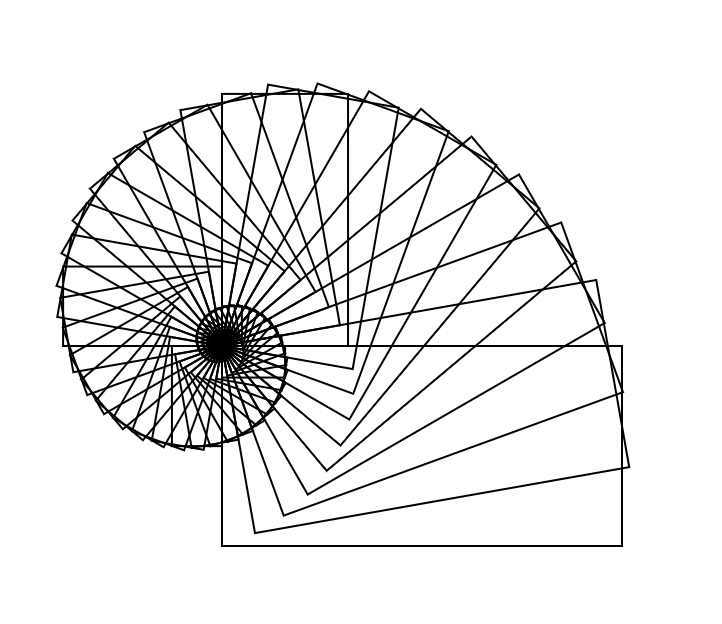
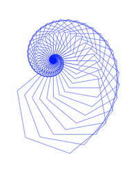

 

This is a demo of the Kwarrtz/render library.  We will make a Nautilus figure
by repeatedly rotating and scaling a base image with respect to one corner.
For this we use the `orbit` function in the included `Iterate` module.

The image on the left above is created by running `elm-make Nautilus.elm --output nautilus.html`, then opening `nautilus.html` in a browser.  The image on the right above is created by running `elm-make Hexagon.elm --output nautilus2.html`, then opening `nautilus2.html` in a browser. 

You can play around with this code. For example, consider these two lines in `Nautilus.elm`
```
shapes =
    orbit ((crotate -10) >> (cscale 0.95 0.95)) 80 baseShape |> List.map (translate 300 300)
```
Here `-10` means "rotate 10 degrees counterclockwise," `cscale 0.95 0.95` means
"scale the given figure by a factor of 0.95".  The `80` sets the number of transformed
shapes to be generated.  Experiment with different values of these parameters.

For more Elm graphics-related demos, see <a href="http://jxxcarlson.github.io">jxxcarlson.github.io</a>.  For a discussion of how the code in these examples works, see this <a href="https://medium.com/@jxxcarlson/drawing-repetitive-images-in-elm-2a4d7199026a">article on Medium.com</a>

